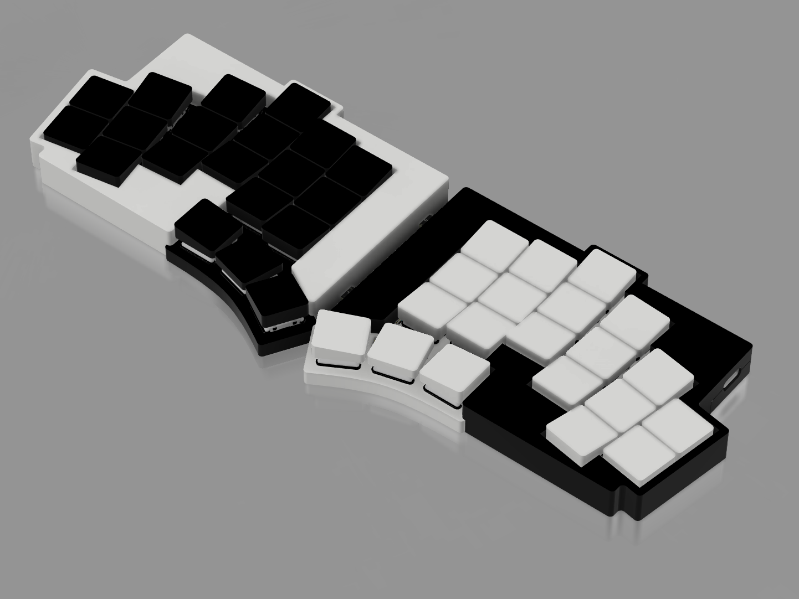
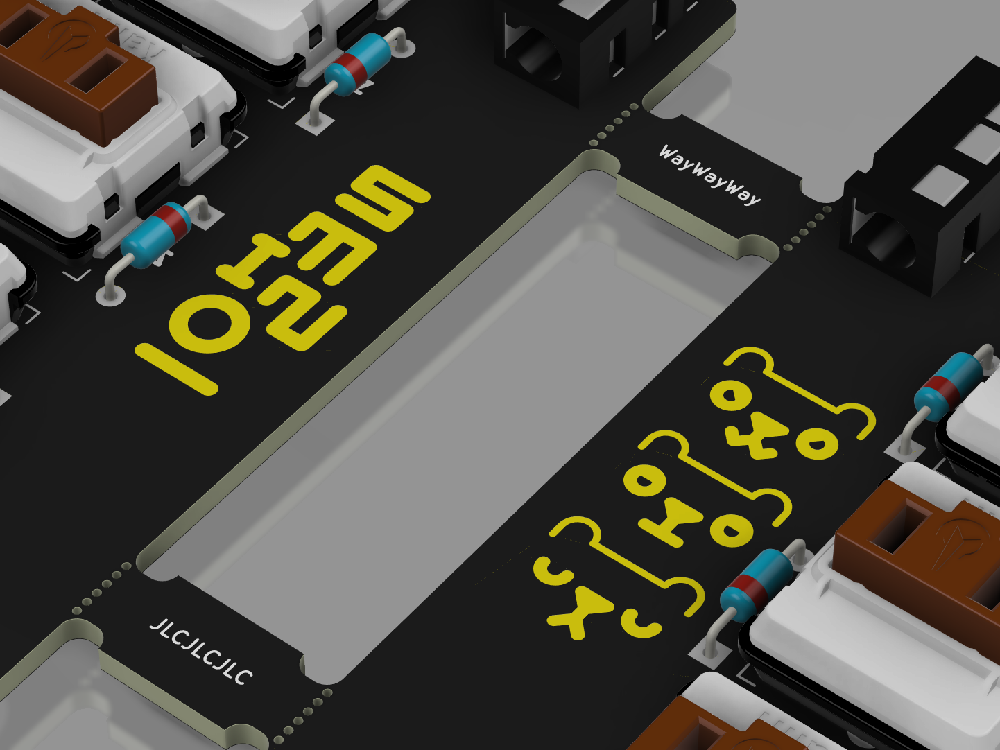

# Custom Keyboard

Personalized Totem Keyboard: PCB and Case Completely reworked.

Inspirations:

- [TOTEM Keyboard](https://github.com/GEIGEIGEIST/TOTEM)
- [MOTE Keycaps](https://www.printables.com/model/864126-mote-choc-low-profile-flat-keycaps)
- [REDUX Case](https://www.printables.com/model/840146-totem-redux)

## Revision 1

Revision 1 is focused on using parts i have at home. This impedes the case design a little bit though, as the THT diodes intersect with the Original switch plate

|  |  |
| :--------------------: | :------------------------: |
|    Keyboard Preview    |             PCB            |
